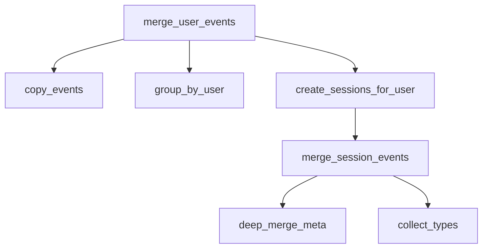

# Merge User Events Implementation Plan

## Problem Summary

Implement `merge_user_events(events)` that groups user events into "sessions" based on time proximity.

**Input**: List of event dictionaries with `user_id`, `ts`, `type`, and `meta` fields.

**Output**: List of session dictionaries sorted by `start_ts`, where each session merges consecutive events for the same user within 10-minute (≤600s) gaps.

---

## Phase 1: Problem Exploration

### Explicit Requirements

| # | Requirement |
|---|-------------|
| 1 | Group events by `user_id` |
| 2 | Within each user, merge consecutive events with gaps ≤ 600 seconds |
| 3 | Output sessions: `{user_id, start_ts, end_ts, types, meta}` |
| 4 | `types`: chronological order, duplicates removed, preserve count |
| 5 | `meta`: deep merge, conflicts → keep earliest value |
| 6 | Output sorted by `start_ts` ascending (across all users) |
| 7 | Input may be unsorted |
| 8 | Must NOT modify input in-place |

### Implicit Requirements

- Empty input → return empty list
- Single event → session with `start_ts == end_ts`
- `types` should preserve insertion order (use Python 3.7+ dict ordering)
- Deep copy input before processing to prevent mutation

### Clarification Needed

> [!IMPORTANT]
> **Ambiguity in `types` field**: The spec says "duplicates removed, but count preserved."
> 
> **Interpretation**: The `types` list contains unique event types in chronological order of first occurrence. A separate count is NOT explicitly stored in output—"count preserved" likely means we track order correctly.
> 
> **Assumption**: `types` = unique types in order of first occurrence (no explicit count field).

### Edge Cases

| Case | Expected Behavior |
|------|-------------------|
| Empty input `[]` | Return `[]` |
| Single event | Session with `start_ts == end_ts`, single type |
| Same user, exact same timestamp | Same session, merge order undefined but deterministic |
| Gap exactly 600s | Same session (≤ 600) |
| Gap 601s | New session (> 600) |
| Multiple users interleaved | Separate sessions per user, final sort by `start_ts` |
| Nested `meta` with conflicts | Deep merge, earliest value wins |
| `meta` with nested dicts at different depths | Only merge if both are dicts |
| Missing `meta` key | Treat as empty dict |
| `None` values in meta | Keep earliest (could be `None`) |

### Risk Areas

- **Mutation**: Accidentally modifying input events
- **Meta merge conflicts**: Incorrect deep merge logic
- **Ordering**: Not handling unsorted input correctly
- **Types deduplication**: Losing chronological order
- **Boundary condition**: Off-by-one on 600s threshold

---

## Phase 2: Design

### Algorithm Overview

```
1. Deep copy input events (prevent mutation)
2. Group events by user_id (dict: user_id → list of events)
3. For each user:
   a. Sort events by timestamp
   b. Split into sessions (gap > 600s = new session)
   c. For each session: merge types and meta
4. Collect all sessions
5. Sort by start_ts
6. Return
```

### Component Breakdown



| Component | Responsibility |
|-----------|----------------|
| `deep_copy_events(events)` | Create deep copy of input |
| `group_by_user(events)` | Dict mapping `user_id` → `[events]` |
| `create_sessions_for_user(events, user_id)` | Split sorted events into sessions |
| `merge_session_events(events, user_id)` | Create single session dict |
| `deep_merge_meta(base, new)` | Recursive merge with earliest-wins |
| `collect_types(events)` | Unique types in chronological order |

### Pseudocode

```python
def merge_user_events(events):
    if not events:
        return []
    
    # 1. Deep copy to avoid mutation
    events_copy = deep_copy(events)
    
    # 2. Group by user_id
    user_groups = group_by_user(events_copy)
    
    # 3. Create sessions for each user
    all_sessions = []
    for user_id, user_events in user_groups.items():
        sorted_events = sorted(user_events, key=lambda e: e['ts'])
        sessions = create_sessions(sorted_events, user_id)
        all_sessions.extend(sessions)
    
    # 4. Sort all sessions by start_ts
    return sorted(all_sessions, key=lambda s: s['start_ts'])
```

### Complexity Analysis

- **Time**: O(n log n) — sorting events
- **Space**: O(n) — deep copy + session storage

---

## Proposed Changes

### [NEW] [merge_events.py](file:///Users/hendrawardana/Documents/interview/whitefox/merge_events.py)

Implement the following functions:

1. **`deep_merge_meta(base: dict, new: dict) -> dict`** — Recursive deep merge
2. **`collect_unique_types(events: list) -> list`** — Unique types in order
3. **`group_events_by_user(events: list) -> dict`** — Group by user_id
4. **`create_session(events: list, user_id: str) -> dict`** — Merge events into session
5. **`split_into_sessions(sorted_events: list, user_id: str) -> list`** — Split by 600s gap
6. **`merge_user_events(events: list) -> list`** — Main entry point

---

### [NEW] [test_merge_events.py](file:///Users/hendrawardana/Documents/interview/whitefox/test_merge_events.py)

Comprehensive pytest test suite covering:

- Empty input
- Single event
- Multiple events same session
- Session boundary (600s vs 601s)
- Multiple users
- Deep merge meta conflicts
- Nested meta merging
- Unsorted input handling
- No input mutation

---

## Verification Plan

### Automated Tests

Run the test suite with pytest:

```bash
cd /Users/hendrawardana/Documents/interview/whitefox
python -m pytest test_merge_events.py -v
```

**Test Categories**:
1. Unit tests for `deep_merge_meta`
2. Unit tests for `collect_unique_types`
3. Integration tests for `merge_user_events`
4. Edge case tests

### Manual Verification

After implementation, manually verify with the example from the spec:

```python
from merge_events import merge_user_events

events = [
    {"user_id": "u1", "ts": 1500, "type": "click", "meta": {"page": "/"}},
    {"user_id": "u1", "ts": 1000, "type": "view", "meta": {"page": "/home"}},
    {"user_id": "u1", "ts": 2200, "type": "click", "meta": {"page": "/about"}},
]

result = merge_user_events(events)
# Expected: 2 sessions for u1
# Session 1: start_ts=1000, end_ts=1500 (gap=500s ≤ 600)
# Session 2: start_ts=2200, end_ts=2200 (gap=700s > 600, new session)
```

---

## Assumptions & Trade-offs

| Assumption | Rationale |
|------------|-----------|
| `types` = unique types in first-occurrence order | Spec says "duplicates removed, count preserved" — interpreted as ordered unique list |
| Missing `meta` treated as `{}` | Defensive: avoid KeyError |
| `copy.deepcopy` is acceptable | Simplest way to prevent mutation |
| Python 3.7+ dict ordering | Standard in modern Python |

| Trade-off | Decision |
|-----------|----------|
| Simplicity vs. performance | Chose clarity over micro-optimization |
| Deep copy entire input | Safer than selective copying |
